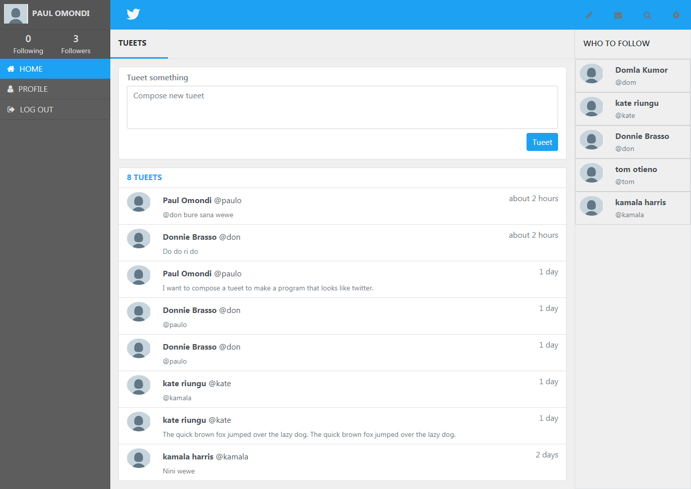

# Tuitter

> A Twitter redesign ...

The program is a friendly Twitter redesign that allows for a simple login using the username. Users sign up with their fullname and a username and optionally a profile picture. The page then opens to a dashboard where they can view all 'tueets' and compose new 'tueets'. They can also also see the list of users that they can follow and can access their profiles and others profiles to view or to send tagged tueets. Enjoy!

## Built With

- Ruby on Rails
- Bootstrap

## Getting Started

To get a local copy up and running follow these simple steps:

### Prerequisites - Ruby, Ruby on Rails, Bundler, Sqlite and a few Gems

Visit http://railsinstaller.org/ and follow the instructions to download all the pre-requisites. 

### Setup

Clone or download https://github.com/paulo-techie/tuitter files to your working folder

### Install Gems

From the command-line or terminal check 'gem list --local' run 'bundle install' to install required gems and then use the command 'gem list --local' to make sure they are installed

bundle install 

### Usage

Make sure you are in the working folder or move to it using either one of the following on the command line or terminal: 
cd tuitter 
chdir tuitter

And then run migrations using:

rails db:migrate 

And then finally run the program using:

rails server

### Run tests

Run RSPEC tests using the following on the command line or terminal:

rspec

## Author

👤 Paul Omondi

- Github: [@paulo-techie](https://github.com/githubhandle)
- Linkedin: [@paul-o-43051a31](https://www.linkedin.com/in/paul-o-43051a31/)

## 🤝 Contributing

Contributions, issues and feature requests are welcome!

Feel free to check the [issues page](issues/).

## Show your support

Give a ⭐️ if you like this project!

## Acknowledgments

- Hat tip to anyone whose code was used
- Inspiration
- etc

## 📝 License

This project is [MIT](lic.url) licensed.
